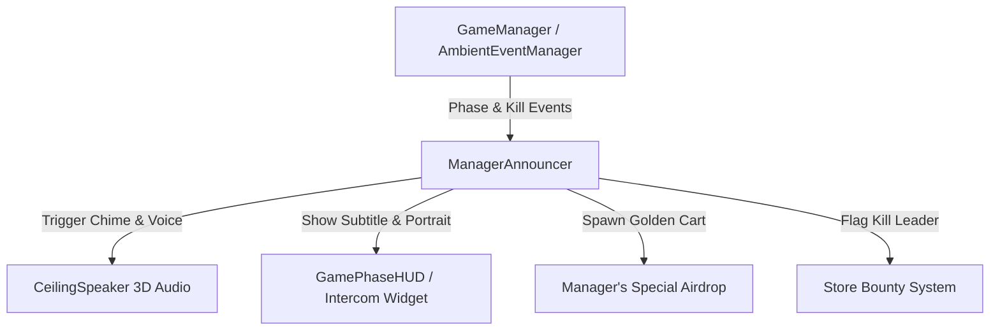

# Mr. Henderson — General Manager, Store #404
## Character Hook & Gameplay Wildcard Specification for *Shopping Wars*

---

## 1. Executive Summary & Character Concept

**Shopping Wars** is a fast-paced, comic-book toon supermarket battle royale. To transform it from a fun mechanic prototype into an unforgettable, viral, and culturally sticky game, it requires an iconic anchor personality.

Enter **Mr. Henderson** — the chronically overworked, passive-aggressive, corporate-brainwashed General Manager of SuperMart Store #404.

To Mr. Henderson, four armed shoppers beating each other with baguettes, sledgehammers, and frozen pizzas is **not a tragedy** — it is:
1. An annoying OSHA paperwork liability.
2. An inventory shrinkage calculation.
3. An aggressive corporate sales opportunity to clear expiring stock.

---

## 2. Character Persona & Voice Direction

- **Name:** Mr. Henderson (Nametag: *"Mr. Henderson — General Manager / Shift Leader"*).
- **Vibe:** Cave Johnson (*Portal 2*) meets a tired retail department manager who hasn't slept since Black Friday 2018.
- **Audio Presence:** Broadcasts arena-wide over ceiling speakers (`Sounds/store_chime.wav` followed by radio intercom filtering and dynamic mic crackle).
- **Visual Expression:** Retro intercom HUD panel with dynamic 2D cartoon portraits reflecting his current emotional state (Annoyed, Greedy, Panicked, Smug, Megaphone Scream).

---

## 3. Core Gameplay Systems Driven by Henderson

### A. Dynamic Intercom Commentary & Kill Roasts
Henderson monitors security cameras (`LaserCamera`) and reacts through the intercom:
- **Phase Announcements**: Welcoming shoppers, warning of store lockdowns, and mocking those caught in the shrinking zone.
- **Contextual Kill Reactions**: Specialized roasts based on weapons (e.g. Produce, Frying Pan, Explosive Propane Tank).
- **Multikills**: Celebrating "Buy One, Get One" violence specials.

### B. "Manager's Special" (Dynamic Airdrop Event)
- Mid-match battle royale mechanic when combat stalls.
- Henderson announces a flash clearance sale on the PA:
  > *"Attention bargain hunters! Corporate just authorized a MANAGER'S SPECIAL on the center island! Go fight for it!"*
- A ceiling spotlight snaps on over a designated display, spawning a **Golden Mystery Shopping Cart** packed with high-tier rare weapons (Sledgehammer, Propane Tank, Golden Frying Pan, Mega Health Sodas).

### C. "Store Bounty: Customer of the Month" (Anti-Snowball Mechanic)
- If a player gets 2+ eliminations and dominates the lobby:
  > *"Shopper [Name] is taking ALL the discounts! There is now a $50 bounty on their head! Bring me their cart!"*
- Puts a temporary golden shopping cart target marker over the kill leader. Eliminating the bounty target awards instant bonus cash and a burst of health.

### D. Ambient Event Commentary
Henderson ties directly into `AmbientEventManager`:
- **Lights Out**: *"Who forgot to pay the electric bill?! Groomba, switch to night-vision!"*
- **Sprinklers**: *"Ceiling sprinkler malfunction! Be advised, slipping on wet tiles voids your right to sue!"*
- **Groomba Rage**: *"Warning: Maintenance has unchained the Groomba. Do not make eye contact."*
- **Clearance Sale**: *"BLUE LIGHT SPECIAL! All damage dealt boosted by 50%! Everything must go, including your rivals!"*

---

## 4. Technical Architecture

1. **`ManagerAnnouncer.cs`**:
   - Singleton manager handling the audio queue, cooldown timers (to prevent spam), and priority system (Game Over > Bounties > Kills > Ambient > Idle banter).
   - Works seamlessly with or without voice audio files: plays `store_chime.wav` and renders the animated HUD widget with subtitles.

2. **`ManagerIntercomHUD.tscn` / `GamePhaseHUD` Integration**:
   - Slide-in comic intercom frame with speaker grill texture, blinking broadcast LED, animated portrait, and styled comic dialogue bubble.

3. **`CeilingSpeaker.cs` Integration**:
   - 3D spatial broadcast so voice resonates through the store arena with distance falloff, creating authentic supermarket acoustics.
